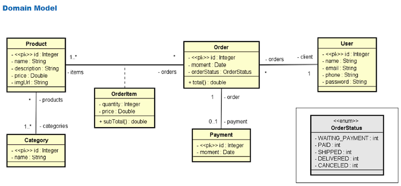

# Web Services application with Spring Boot and JPA/Hibernate

## Objectives
* Create a Spring Boot application;
* Implement the domain model;
* Structure the logical layers: Controllers, Services and Repositories;
* Using the h2 test database;
* Using JPA and Hibernate;
* Implement a CRUD;
* Understand and apply concepts of a Restful API;
* Implement exception handling.

## Technologies used
* IntelliJ IDEA;
* Java 17 LTS;
* Spring Boot 3.0.1;
* Maven;
* JPA;
* Hibernate;
* H2;
* MySQL;
* Postman.

## Domain model

